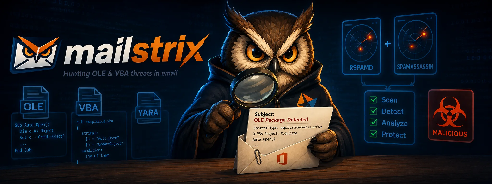

<p align="center">
  <a href="https://mailstrix.com"></a>
</p>

# strixd — YARA malware scanning for rspamd

**Mailstrix is the owl that finds malware hiding in your mail.** It takes hostile
attachments apart — unwrapping OLE2/OOXML, VBA, RTF objects, PDFs, archives and
nested carriers — until YARA detection rules can finally see the dangerous bits.
It runs out-of-process behind Rspamd (async HTTP), SpamAssassin, an ICAP server,
Dovecot Sieve, or standalone.

[](https://github.com/eilandert/mailstrix/actions/workflows/ci.yml)
[](https://github.com/eilandert/mailstrix/actions/workflows/release.yml)
[](https://pkg.go.dev/github.com/eilandert/mailstrix)

**strixd is a small HTTP service that scans email for malware with
[YARA](https://virustotal.github.io/yara/).** You hand it a message (or one
attachment) on `POST /scan`; it runs ~10,000 curated public YARA rules over it
and tells you which ones matched. It ships as a ready-to-run Docker image with
the rules already baked in — see **[Quick start](#quick-start)** below or pull it
straight from **[Docker Hub](https://hub.docker.com/r/eilandert/mailstrix)**.

**Why YARA, in one paragraph.** YARA is the rule engine malware analysts use to
recognise *families* of malicious files — booby-trapped Office docs, packed
executables, phishing kits, script droppers. A plain string signature dies the
moment the author edits one byte; a YARA rule matches the *shape* of a file (PE
imports, section entropy, embedded magic) and survives the next variant. strixd
compiles those rules — libyara modules and all — and runs them over your mail.

**Four ways to plug it into a mail server, all shipped in this repo:**

- **rspamd** — an async `mailstrix.lua` plugin ([`contrib/rspamd/`](contrib/rspamd/)) POSTs each
  message/part to strixd at SMTP time and turns the hits into a spam-score symbol.
- **SpamAssassin** — the [`Mailstrix.pm`](contrib/spamassassin/) plugin scans each message
  through the same central service and turns a YARA match into a spam-score hit
  ([`contrib/spamassassin/`](contrib/spamassassin/)).
- **Dovecot / Sieve** — the lean [`strix-scan`](#thin-client-for-dovecot--sieve-strix-scan)
  client scans at *delivery* and a Sieve rule quarantines a match
  ([`contrib/sieve/`](contrib/sieve/)).
- **ICAP** — set `MAILSTRIX_ICAP_ADDR` and strixd also speaks ICAP (RFC 3507) so an
  ICAP-aware proxy or content-filter (Squid, c-icap) scans REQMOD/RESPMOD bodies
  through the same engine ([ICAP mode](#icap-mode-optional)).

```
 ┌──────────────────────┐  POST /scan  ┌──────────────┐    ┌──────────────┐
 │ rspamd (mailstrix.lua)│ ───────────▶ │    strixd    │ ─▶ │   libyara    │
 │ SpamAssassin / Sieve  │ ◀─────────── │ (Go service) │    │compiled rules│
 │ (strix-scan) / ICAP   │   {matches}  └──────────────┘    └──────────────┘
 └──────────────────────┘
```

> **Where should YARA scanning live — opinion.** YARA scanning is genuinely
> CPU-intensive, and the MTA hot path is the most latency-sensitive place to spend
> that CPU: every connection waits on it, and at SMTP time you scan a lot of mail
> you will reject anyway. A defensible view is that it doesn't belong in the MTA at
> all — scanning at **delivery** (Dovecot LDA / Sieve), *after* rspamd has already
> dropped the obvious spam, scans far less and off the connection's critical path.
> Which is right depends on your mailflow and goals: scan early at SMTP to *reject*
> with rspamd's score, or scan late at delivery to *quarantine* a smaller, cleaner
> stream. strixd supports both; see the [thin client](#thin-client-for-dovecot--sieve-strix-scan)
> and [`contrib/sieve/`](contrib/sieve/) for the delivery-time path.

It runs **out of process**, never inside the MTA worker, because libyara is a C
library (CGO): in an rspamd worker it would block the event loop and drag a heavy
C dependency into the mail image. Separate, the caller stays async and strixd can
be scaled, restarted, or reload its rules on its own. Same shape as the
[gozer](https://github.com/eilandert/gozer) DCC/Razor/Pyzor backend.

> 📋 Jump to **[Status & roadmap](#status--roadmap)** for what's done vs planned.

## Exactly what it does

- **Scans mail with YARA** — `POST /scan` raw message bytes (or one MIME part),
  get back the matched rules as JSON; the rspamd `mailstrix.lua` plugin
  ([`contrib/rspamd/`](contrib/rspamd/)) wires the hits into the spam score, or the `strix-scan`
  client scans at delivery from Dovecot/Sieve ([`contrib/sieve/`](contrib/sieve/)).
- **Ships ~10k public rules baked in** — YARA-Forge, signature-base, ANY.RUN,
  Didier Stevens, bartblaze, InQuest, CAPEv2, YARAify; precompiled `.yac`, daily refresh.
- **Decompresses Office macros before matching** — MS-OVBA VBA out of
  `.docm`/`.xlsm`/`.doc`/`.xls`, scans the cleartext (sets the `VBA` rule var).
- **Cracks open containers** — pulls the hidden payload out of: OLE2/OOXML,
  RTF `\objdata`, OLE Package (`Ole10Native`), MSI, Outlook `.msg`, TNEF
  (`winmail.dat`), OneNote `.one`, PDF (FlateDecode streams), `.lnk` shortcuts,
  VBE/JSE encoded scripts, and nested archives (zip/7z/rar/gz/tar.gz/cab, recursive)
  — then scans each.
- **Deobfuscates before matching** — decodes long base64/hex runs, undoes
  `StrReverse`, and folds the olevba string set (`Chr`/`ChrW` concat,
  `Replace()`, `Array() Xor k`, `Environ`, Dridex `DridexUrlDecode`) to
  cleartext; a bounded recursive pass unwinds **multi-stage** (2+-layer)
  payloads, not just the first layer.
- **Resolves Excel 4.0 (XLM) macros** — detects hidden/very-hidden macrosheets
  (OOXML + legacy `.xls` BIFF), reassembles `ptg`-token formula strings
  (BIFF8/`.xlsb`/SLK), and runs a **bounded XLM emulator** (cell eval, `GOTO`,
  `SET.VALUE`) to resolve obfuscated cell references.
- **Triages PDFs** — surfaces `/OpenAction`, `/JS`, `/Launch`, `/EmbeddedFile`,
  `/JBIG2Decode` and hex-name obfuscation as scoreable markers.
- **Catches macro-less & exploit attacks** — Equation Editor (CVE-2017-11882),
  remote-template injection (CVE-2017-0199 / T1221), DDE/DDEAUTO fields,
  MHTML/`x-usc` (CVE-2021-40444), Shell.Explorer CLSID, and OLE structural
  indicators (`ObjectPool`, embedded Flash, digital-signature, doc-security).
- **Decrypts default-password documents** — VelvetSweatshop XOR, BIFF8 RC4, and
  OOXML agile/standard AES, so an "encrypted" but default-keyed payload is
  unlocked and re-scanned (other encryption is flagged, not cracked).
- **Analyses carved executables** — PE/ELF structural checks on embedded/decoded
  binaries (section entropy / packing, overlay, .NET, anomalies), plus base64-PE
  carving that re-aligns a padded `MZ` header so the `pe` rules fire.
- **Ships its own heuristic rules** — an mraptor-style autoexec∧write∧execute
  rule, olevba suspicious-keyword / VBA-shellcode-API heuristics, LOLBin / WMI /
  PowerShell / anti-analysis intent rules, HTML-smuggling (`data:` URI, embedded
  SVG) detection, and a position-independent-shellcode `GetEIP` prologue rule.
- **Scales effort under load** — a single 1–10 effort dial (`MAILSTRIX_EFFORT`)
  scales decode depth, XLM/PDF clamps, feeds and scan timeout; `auto` sheds a
  level at a time as the admission gate fills and climbs back as it drains.
- **Speaks ICAP too (optional)** — `MAILSTRIX_ICAP_ADDR` adds an RFC 3507
  REQMOD/RESPMOD listener for ICAP-aware proxies, sharing the same scan engine,
  cache and concurrency gate as `/scan`.
- **Uses the attachment name** — `filename`/`extension` YARA vars from the
  plugin's `X-MAILSTRIX-Filename`, so name-keyed (THOR/Loki) rules fire.
- **Checks abuse.ch feeds (optional)** — URLhaus malware-URL/host lookup (with
  URL defanging), MalwareBazaar attachment-SHA256 lookup, and ThreatFox
  URL/domain IOCs; all cached, fail-open.
- **Drops/demotes noisy rules** — `MAILSTRIX_RULE_DENYLIST` (suppress) and
  `MAILSTRIX_RULE_ALLOWLIST` (keep but score log-only) without patching upstream.
- **Canary mode** — `MAILSTRIX_CANARY=1` returns hits as log-only metadata so
  integrations can observe rule/feed behaviour without scoring or blocking mail.
- **Caches verdicts** — `SHA256(body)` → matches (LRU+TTL), plus request
  coalescing and an optional shared Redis/Valkey L2, for a high-volume firehose.
- **Fails open, always** — a scan error, timeout, or libyara panic is reported
  as "no match"; a broken scanner never blocks mail. Bounded concurrency,
  per-scan timeout, body cap, graceful drain on SIGTERM.
- **Updatable rules without a rebuild** — `strixd fetch-rules` pulls a
  version-matched, sha256-verified compiled bundle into a cache; SIGHUP reloads.
- **CLI tools** — `strixd scan` (local triage), `strixd extract` (dump what a
  container carves), `strixd check-rules`, `strixd info`; and `strix-scan`, a tiny
  CGO-free client for a Dovecot/Sieve box ([`contrib/sieve/`](contrib/sieve/)).
- **Observable** — `/health`, `/ready`, `/version`, Prometheus `/metrics`
  (scans, matches, cache, per-extractor counters, rule staleness).

## Install

Three ways, pick one:

**Debian/Ubuntu package** (`.deb`, amd64 + arm64) — attached to every
[release](https://github.com/eilandert/mailstrix/releases/latest):

```sh
# Resolve the latest version + your arch (release assets are version-pinned,
# e.g. strixd_1.1.0_amd64.deb — the bare latest/download/ path is not).
VER=$(curl -fsSL https://api.github.com/repos/eilandert/mailstrix/releases/latest \
        | grep -oP '"tag_name":\s*"v\K[^"]+')
ARCH=$(dpkg --print-architecture)   # amd64 or arm64
BASE=https://github.com/eilandert/mailstrix/releases/download/v${VER}

# strixd — the daemon (systemd unit + /etc/mailstrix/strixd.env config)
curl -fsSLO "${BASE}/strixd_${VER}_${ARCH}.deb"
sudo apt install "./strixd_${VER}_${ARCH}.deb"

# fetch the rolling compiled rule bundle into the cache dir, then start it
sudo -u strixd strixd fetch-rules -cache-dir /var/cache/mailstrix   # or drop your own .yar in /var/lib/mailstrix/rules
sudoedit /etc/mailstrix/strixd.env                                 # set MAILSTRIX_TOKEN, feeds, …
sudo systemctl enable --now strixd

# strix-scan — the lean CGO-free Sieve/LDA client (no daemon)
curl -fsSLO "${BASE}/strix-scan_${VER}_${ARCH}.deb"
sudo apt install "./strix-scan_${VER}_${ARCH}.deb"
```

The daemon package installs a hardened systemd unit (unprivileged `strixd` user,
`ProtectSystem=strict`, `NoNewPrivileges`) and a documented
`/etc/mailstrix/strixd.env`. State (rules) lives in `/var/lib/mailstrix`.

**Static binaries** — `strixd-linux-{amd64,arm64}` and
`strix-scan-linux-{amd64,arm64}` plus `SHA256SUMS` are on the same release page.

**Docker** — see [Quick start](#quick-start) below (rules baked in).

## Quick start

The image already bakes ~10k rules, so a token is all you need:

```sh
docker run -d --name strixd \
    -e MAILSTRIX_TOKEN=changeme \
    -p 8079:8079 \
    eilandert/mailstrix

# ask it something:
printf 'hello' | curl -s -H 'X-MAILSTRIX-Token: changeme' \
    --data-binary @- http://127.0.0.1:8079/scan
# -> {"matches":[]}
```

To use your own rules instead of the baked bundle:

```sh
docker run -d --name strixd \
    -e MAILSTRIX_TOKEN=changeme \
    -e MAILSTRIX_RULES= \
    -e MAILSTRIX_RULES_DIR=/rules \
    -v "$PWD/myrules:/rules:ro" \
    -p 8079:8079 \
    eilandert/mailstrix
```

Send an attachment name so name-keyed rules fire (base64 — the name is
attacker-controlled, encoding it stops header injection):

```sh
printf 'MZ...' | curl -s -H 'X-MAILSTRIX-Token: changeme' \
    -H "X-MAILSTRIX-Filename: $(printf 'invoice.exe' | base64)" \
    --data-binary @- http://127.0.0.1:8079/scan
```

> **Token is optional but recommended.** Set `MAILSTRIX_TOKEN` (or
> `MAILSTRIX_TOKEN_FILE`) and the caller must present the same secret as a `Bearer`
> header or `X-MAILSTRIX-Token`. Leave it unset (or `none`/`0`/`off`) to run an
> **open** scanner for a trusted private network — strixd logs a loud warning,
> since anyone who can reach the port can submit CPU-costly scans.

The `/scan` reply names the rule **and** its source ruleset file:

```json
{"matches":[{"rule":"Suspicious_Macro","namespace":"sigbase-gen_maldoc.yar","tags":["office"],"meta":{"author":"…"}}]}
```

The list is `[]` (never `null`) when nothing matched. `namespace` is the file the
rule was compiled from, so a generic rule like `http` is traceable to the set
that shipped it. For the hardened container setup (read-only rootfs, dropped
caps, Docker secret, static IPv4) see
[`docker/docker-compose.yml`](docker/docker-compose.yml).

## Scanning without a server

The same binary scans locally — no HTTP, no token — by compiling the rules
in-process. For one-off triage and pipelines:

```sh
strixd scan suspicious.doc            # one file
strixd scan /var/mail/cur             # a maildir, recursed
cat msg.eml | strixd scan             # stdin
strixd scan -json /tmp/quarantine     # machine-readable
```

Exit codes: **0** clean, **1** ≥1 match, **2** usage/load/read error. Other
helpers share the binary (`strixd help`):

```sh
strixd check-rules            # compile rules, print the count, non-zero on failure (CI gate)
strixd extract suspicious.doc # show what the extractor carves (no scan)
strixd fetch-rules            # update the cached rule bundle from the release
strixd info                   # build / libyara / loaded-bundle identity
```

### Updating rules without rebuilding (`fetch-rules`)

Rules move faster than image rebuilds — and outside Docker you'd otherwise need
`yarac` + a matching libyara to compile them. `strixd fetch-rules` downloads a
prebuilt, version-matched bundle into the cache instead:

```sh
strixd fetch-rules -cache-dir /var/cache/mailstrix
```

It reads a small manifest first and updates only when the published **version**
is newer; it **refuses** a bundle built against a different **libyara**,
**verifies the sha256**, and swaps atomically (keeping one `.bak`). On any error
the current bundle is untouched. Then SIGHUP (or restart) strixd to load it. The
bundle is published by `docker/generate-rules.sh` (run from cron); point `-url` /
`MAILSTRIX_RULES_URL` at a mirror if not fetching from GitHub.

## Thin client for Dovecot / Sieve (`strix-scan`)

`strixd scan` (above) compiles the rules **in-process**, so it needs libyara and
the rule set on the host that runs it — fine on the scanner box, too heavy for a
mail-delivery box that should stay thin. **`strix-scan`** is the answer: a
separate, tiny client that links **no CGO / libyara and embeds no rules** — pure
Go, a ~6 MB static binary you can drop on any mail host. It just reads the
message (stdin or a file), POSTs it to a central `strixd serve`, and exits on the
verdict — so all the CPU-heavy scanning stays on the central service.

```sh
# stdin or a file; exit code carries the verdict:
strix-scan -url http://strixd.internal:8079 -token-file /etc/strixd.token - < message
cat message | strix-scan -url http://strixd.internal:8079
```

| | |
|--|--|
| **Exit 0** | clean — no actionable rule matched (**also** for canary/allowlisted log-only hits and on a fail-open scanner outage) |
| **Exit 1** | at least one actionable rule matched |
| **Exit 2** | usage / read / (fail-closed) transport error |

- **Fails open by default** — any transport error, timeout, or non-200 is treated
  as *clean* (exit 0), so a scanner outage never blocks or bounces delivery. Pass
  `-fail-open=false` for interactive triage where a silent miss is worse.
- **Token** via `-token-file` or `MAILSTRIX_TOKEN` — never `-token` on a shared host
  (it shows in `ps`). Redirects are never followed, so the token can't leak to a
  3xx target.
- **Same wire format** as the rspamd plugin: `X-MAILSTRIX-Token` for auth, base64
  `X-MAILSTRIX-Filename` for the attachment name.
- **Structured verdict** — `-json` prints
  `{"malicious":bool,"family":"<name|>","confidence":"family|rule|","rules":[...]}`
  and `-label` prints a single `LABEL <family>` line (nothing when no family is
  known). The family comes from the matched rules' metadata
  (`family` / `malware_family` / `actor`, in that order); generic/technique rules
  that carry no family meta still count as malicious but contribute no family. One
  family per file = the highest-confidence family-bearing hit. Useful for labelling
  a malware-store sample's family without burning external lookup quota.
  `-json` and `-label` are mutually exclusive (passing both is a usage error).

This is the **delivery-time** path from the opinion in the intro: let rspamd drop
the obvious spam at SMTP, then scan the smaller, cleaner stream with YARA at
delivery and quarantine a hit — off the connection's critical path.

A ready-to-use Dovecot Sieve example (the `execute` rule, an install wrapper, the
dovecot config, and a setup/test walkthrough) lives in **[`contrib/sieve/`](contrib/sieve/)**.
Because the client fails open, a delivery is never lost if the backend is down.

## Configuration

Every setting is an env var and a `serve` CLI flag (flag > env > default).

| Env | Default | Meaning |
|-----|---------|---------|
| `MAILSTRIX_HOST` / `MAILSTRIX_PORT` | `0.0.0.0` / `8079` | HTTP bind address |
| `MAILSTRIX_TOKEN[_FILE]` | — | shared secret for `/scan` (optional); comma-separated for zero-downtime rotation (e.g. `old,new`); unset / `none` / `0` / `off` ⇒ auth disabled, `/scan` runs **open** (warned at startup) |
| `MAILSTRIX_TOKEN_NEXT[_FILE]` | — | incoming rotation token accepted alongside the primary; append here then migrate clients, then promote to `MAILSTRIX_TOKEN` and clear this |
| `MAILSTRIX_RULES_DIR` | `/rules` | dir of `*.yar`/`*.yara` compiled at boot and on SIGHUP |
| `MAILSTRIX_RULES` | — | a precompiled `.yac` bundle; loaded instead of `RULES_DIR` (faster start) |
| `MAILSTRIX_RULES_MAX_AGE` | `0` (off) | seconds; flag rules `stale` (metric + `/ready` body) once older than this. Fail-open: never fails readiness |
| `MAILSTRIX_SCAN_TIMEOUT` | `8` (s) | per-request libyara budget (raw + all extracted streams share it) |
| `MAILSTRIX_BACKEND_TIMEOUT` | `1` (s) | how long to wait for an admission / scan slot |
| `MAILSTRIX_MAX_CONCURRENT` | `auto` (CPU count) | max concurrent libyara scans (CPU gate) |
| `MAILSTRIX_MAX_INFLIGHT` | `auto` (2× concurrent) | max in-flight requests (admission gate); kept above the scan gate so a slow body/Redis can't starve scans |
| `MAILSTRIX_MAX_BODY` | `8388608` (8 MiB) | max request body, in bytes (checked before reading) |
| `MAILSTRIX_EFFORT_MAX` | `10` | effort-tier ceiling (1–10); the hard cap a per-request `X-MAILSTRIX-Effort` header can never exceed (DoS guard) |
| `MAILSTRIX_EFFORT` | `= MAILSTRIX_EFFORT_MAX` | default effort level when no `X-MAILSTRIX-Effort` header is sent (1 = raw + shallowest extraction, max = full depth). Set to `auto` (EFFORT-2) to derive the level from admission-gate pressure — full depth when idle, shedding a level at a time as in-flight scans fill the gate, climbing back as it drains (one level/scan; `mailstrix_effort_auto_level` gauge tracks it). The level scales real work: decode depth, XLM/PDF clamps, reputation feeds and scan timeout are all wired to the resolved profile (EFFORT-4), so a lower level genuinely does less. |
| `MAILSTRIX_ARCHIVE_PW` | `0` (off) | **opt-in**: when `1`, try to decrypt password-protected archive members (zip ZipCrypto + WinZip-AES, 7z, rar) using candidate passwords scraped from the mail (subject/body/filename) plus an optional wordlist, then scan the recovered payload. Default OFF ⇒ an encrypted member is flagged `ARCHIVE-ENCRYPTED` and never decrypted (historical behaviour, byte-identical). The brute loop is hard-bounded: ≤64 candidates, a global per-input attempt cap, a tighter sub-cap for KDF formats (7z/rar/AES), a per-attempt wall-clock watchdog, and a per-attempt deadline check. Fail-open everywhere — any error/cap/timeout degrades to skip + keep `ARCHIVE-ENCRYPTED`. A cracked member emits `ARCHIVE-DECRYPTED`. |
| `MAILSTRIX_ARCHIVE_PW_FILE` | — | optional newline wordlist of extra candidate passwords, loaded once at boot (capped, fail-open) and appended to the per-mail candidates. Consulted only when `MAILSTRIX_ARCHIVE_PW=1`. |
| `MAILSTRIX_CACHE_TTL` | `3600` (s) | verdict cache TTL; `0` disables caching |
| `MAILSTRIX_CACHE_SIZE` | `65536` | in-memory LRU entries |
| `MAILSTRIX_REDIS_URL` | — | optional shared L2 cache, e.g. `redis://host:6379/6` |
| `MAILSTRIX_REDIS_PREFIX` | `yara:scan:` | Redis key prefix |
| `MAILSTRIX_METRICS_AUTH` | off | require the token for `/metrics` and `/version` (`/health` & `/ready` stay open) |
| `MAILSTRIX_URLHAUS_KEY[_FILE]` | — | abuse.ch Auth-Key; enables the URLhaus malware-URL lookup |
| `MAILSTRIX_URLHAUS_REFRESH` | `21600` (6 h) | URLhaus feed refresh (floor 5 min) |
| `MAILSTRIX_URLHAUS_MAX_URLS` | `64` | max URLs examined per message |
| `MAILSTRIX_MBAZAAR_KEY[_FILE]` | — | abuse.ch Auth-Key (same key); enables the MalwareBazaar hash lookup |
| `MAILSTRIX_MBAZAAR_REFRESH` | `86400` (24 h) | MalwareBazaar feed refresh (floor 5 min) |
| `MAILSTRIX_MBAZAAR_FEED` | full dump | override the feed URL (e.g. the lighter "recent" export) |
| `MAILSTRIX_THREATFOX_KEY[_FILE]` | — | abuse.ch Auth-Key (same key); enables the ThreatFox URL/domain IOC lookup |
| `MAILSTRIX_THREATFOX_REFRESH` | `21600` (6 h) | ThreatFox feed refresh (floor 5 min) |
| `MAILSTRIX_THREATFOX_MAX_URLS` | `64` | max URLs/domains examined per message |
| `MAILSTRIX_BIGFILE_THRESHOLD` | `6291456` (6 MiB) | buffers larger than this scan against the smaller `BIGFILE_RULES` set, not the full bundle (cost gate); markers always use the full set; `0` disables the gate |
| `MAILSTRIX_BIGFILE_RULES` | baked seed | optional `.yac` bundle scanned for oversized buffers; unset ⇒ the baked `local.yac` seed set |
| `MAILSTRIX_RULE_DENYLIST` | `http` | comma-sep rule names to suppress (case-insensitive); set empty to disable |
| `MAILSTRIX_RULE_ALLOWLIST` | — | comma-sep rule names to force log-only (kept + tagged `mailstrix_allow`); deny wins if in both |
| `MAILSTRIX_CANARY` | `0` | tag every match as log-only canary/shadow output; shipped rspamd/SpamAssassin/Sieve/ICAP integrations observe but do not score/block these hits |
| `MAILSTRIX_ICAP_ADDR` | — (disabled) | TCP address for the optional ICAP listener (RFC 3507), e.g. `:1344`. When set, strixd also accepts REQMOD/RESPMOD from ICAP-aware proxies (Squid, c-icap). Unset = ICAP disabled. No ICAP-level auth; gate by network/firewall. |
| `MAILSTRIX_VERBOSE` | off | log one line per request |
| `MAILSTRIX_LOG_STDOUT` | off | info/access logs to stdout (errors always stderr) |
| `MAILSTRIX_PPROF` | off | enable `/debug/pprof` profiling endpoints (off by default; auth-gated when `MAILSTRIX_METRICS_AUTH` is set) |

**Reload rules:** `docker kill -s HUP strixd` recompiles in place and flushes the
cache. A reload that fails to compile keeps the previous (working) rules — a bad
edit can't disarm a running scanner. On SIGTERM/SIGINT strixd drains (`/ready` →
`503`, in-flight scans finish) before exiting — safe for rolling updates.

## Sizing profiles

`MAILSTRIX_MAX_CONCURRENT` defaults to the CPU count (`auto`). On a many-core host
(32+ CPUs) that reserves significant memory. The request-buffer ceiling is set by
the admission gate, not the scan gate: up to `MAX_INFLIGHT` requests can each hold
a full body plus its extracted streams, so the startup log estimates peak resident
as roughly `MAX_INFLIGHT × MAX_BODY + RSS` (the loaded-rules resident set). Size
`mem_limit` accordingly and pin `MAX_CONCURRENT`/`MAX_INFLIGHT` explicitly when the
defaults are too aggressive.

`MAILSTRIX_MAX_INFLIGHT` (default `2×MAX_CONCURRENT`) is the admission gate — excess
requests receive a `503` immediately rather than queuing. Keep it above
`MAX_CONCURRENT` so a slow body read or Redis round-trip can't starve scan slots.

Redis/Valkey L2 (`MAILSTRIX_REDIS_URL`) dramatically improves throughput for repeated
attachments, which is common in mail (bulk campaigns, MTA retries, one body to N
recipients). Without it each scanner instance maintains its own in-process LRU
only.

| Profile | `MAILSTRIX_MAX_CONCURRENT` | `MAILSTRIX_MAX_BODY` | `mem_limit` | Redis | Expected p95 | RPS capacity |
|---------|------------------------|------------------|-------------|-------|-------------|-------------|
| **Small** — single mailhost, <100 msgs/min | `2` | `10485760` (10 MiB) | `128m` | optional (LRU only) | <500 ms | ~10 |
| **Medium** — mailhost, 100–1000 msgs/min | `auto` (CPU count) | `26214400` (25 MiB) | `256m` | recommended | <300 ms | ~50 |
| **Large** — cluster, >1000 msgs/min | `auto` | `26214400` (25 MiB) | `512m`+ | required | <200 ms | ~200+ |

Notes:
- MalwareBazaar full-dump mode (`MAILSTRIX_MBAZAAR_KEY` set) adds ~40 MiB resident
  plus a ~100–150 MiB transient spike on refresh — raise `mem_limit` to ~768m in
  that case.
- For the Large profile, run multiple replicas behind a load balancer rather than
  one container with a very high `MAX_CONCURRENT`: smaller per-container concurrency
  improves tail latency under burst load and avoids one libyara panic taking all
  capacity.
- `MAILSTRIX_BACKEND_TIMEOUT` (default `1s`) caps how long a request waits for an
  admission slot. Under sustained overload this is the 503 fuse — keep it short
  so callers (rspamd) fail fast rather than stacking connections.

## Rules

The image bakes eight public rulesets at build time; a daily rebuild
(`--build-arg CACHEBUST=$(date +%s)`) re-pulls the latest. **Full credit to the
authors — strixd only packages their work.** Each set keeps its own license:

| Ruleset | Author / source | License | Notes |
|---------|-----------------|---------|-------|
| **YARA-Forge** | [YARAHQ/yara-forge](https://github.com/YARAHQ/yara-forge) | aggregator (each rule keeps its upstream license) | vetted, deduped multi-repo bundle; default tier `core` (`YARAFORGE_SET=extended`/`full`) |
| **signature-base** | [Neo23x0/signature-base](https://github.com/Neo23x0/signature-base) | [DRL 1.1](https://github.com/Neo23x0/signature-base/blob/master/LICENSE) | the broad community set behind THOR/Loki |
| **ANY.RUN** | [anyrun/YARA](https://github.com/anyrun/YARA) | public detection rules | malware-family + phishing (`ANYRUN=0` to skip) |
| **Didier Stevens Suite** | [DidierStevens/DidierStevensSuite](https://github.com/DidierStevens/DidierStevensSuite) | public domain | OLE/RTF/maldoc + the `vba.yara` macro set (`DIDIER=0` to skip) |
| **bartblaze/Yara-rules** | [bartblaze/Yara-rules](https://github.com/bartblaze/Yara-rules) | MIT | maldoc/RTF + phishing-doc not in YARA-Forge (`BARTBLAZE=0`) |
| **InQuest yara-rules-vt** | [InQuest/yara-rules-vt](https://github.com/InQuest/yara-rules-vt) | MIT | curated mail subset: PDF/LNK/OneNote/`.msg`/RTF (`INQUEST=0`) |
| **CAPEv2** | [kevoreilly/CAPEv2](https://github.com/kevoreilly/CAPEv2) | BSD-3-Clause | curated mail-relevant family rules (Guloader/Formbook/AgentTesla/Obfuscar); raw-fetched, not the full sandbox (`CAPE=0`) |
| **YARAify** | [abuse.ch YARAhub](https://yaraify.abuse.ch/yarahub/) | CC0 | abuse.ch community feed, refreshed daily (`YARAIFY=0`) |

Roughly 10,000+ rules total. Pin or toggle any source with a build arg
(`YARAFORGE_SET`, `*_REF`, `DIDIER=0`/`BARTBLAZE=0`/`ANYRUN=0`/`INQUEST=0`/`CAPE=0`/`YARAIFY=0`).

**Rule profile (PERF-25)** — `MAILSTRIX_PROFILE` selects how much of the fetched
breadth is baked:

- **`mail`** (default) — runs a conservative per-rule filter
  (`docker/filter-rules.py`) over *every* fetched source, dropping only the rules
  that can never fire on a mail attachment's bytes (memory-dump / kernel-driver /
  Linux-ELF-only / pcap / non-redistributable MALPEDIA). A rule is kept whenever a
  maldoc/script/dropper/loader/stealer/RAT token appears in its name (KEEP-wins),
  and all `private` helper rules are always kept. Smaller, faster bundle with **no
  measured loss of mail detection** on the malware corpus.
- **`full`** — bakes every fetched rule, no filtering.

Legacy `YARAFORGE_FILTER=0` is honoured as an alias for `MAILSTRIX_PROFILE=full`.

On top of the public sets, strixd bakes its own local heuristics from
`docker/local-rules/`:

- `Maldoc_AutoExec_Write_Execute` (`maldoc_autoexec.yara`) — an
  [mraptor](https://github.com/decalage2/oletools/wiki/mraptor)-equivalent rule:
  it fires when one buffer combines an **auto-execution** trigger, a
  **file-write/drop** primitive, and an **execute/launch** primitive. The
  three-category `AND` is what keeps it low-FP (a benign document rarely does all
  three at once), and unlike Didier's `vba.yara` it has no `VBA` gate, so it
  also catches non-Office droppers (HTA/WSF/JS, script carriers) in the raw body.
- `Maldoc_Suspicious_VBA_Keywords` + `Maldoc_VBA_Shellcode_API`
  (`maldoc_suspicious.yara`) — the olevba *suspicious-keyword* tier the strict
  rule misses. The first is a **count** heuristic (fires on ≥6 distinct
  exec/persist/network/evasion/obfuscation keywords in one buffer — one keyword
  is noise, six together is a macro doing real work; low score, low tier). The
  second is the specific **VBA shellcode** shape: a `Declare` of a Win32 API
  combined with a process-injection primitive (`VirtualAlloc`, `RtlMoveMemory`,
  `CreateThread`, a hook installer) — benign macros ~never allocate executable
  memory, so it scores higher.
- `OOXML_Remote_Template` (`ooxml_template_injection.yara`) — **remote-template
  injection** heuristic. The extractor reads every `*/_rels/*.rels` part inside
  the OOXML zip and emits a synthetic `OOXML-EXTERNAL-REL <type> <target>` stream
  for any relationship whose `TargetMode="External"` points to an `http://`,
  `https://`, `smb://`, or UNC target. This rule matches that stream, covering
  CVE-2017-0199-style attacks (Word fetches a remote `.dotm`/`.dotx` at open time
  and executes its macros — no embedded macro in the original document). Score 50,
  tagged `suspicious`, routes to `STRIX_SUSPICIOUS`.
- `Maldoc_DDE_Field` (`ooxml_dde.yara`) — **DDE/DDEAUTO field injection**
  heuristic. The extractor reads `word/document.xml` (and header/footer parts),
  extracts field instructions from `w:fldSimple/@w:instr` attributes and from
  concatenated `w:instrText` runs (so obfuscated split-token instructions are
  caught), and emits a synthetic `OOXML-DDE-FIELD <instr>` stream for any
  instruction that begins with `DDE` or `DDEAUTO`. This rule matches that stream,
  covering macro-free command execution via DDE fields (T1559.002). Score 55,
  tagged `suspicious`, routes to `STRIX_SUSPICIOUS`.
- `XLM_Hidden_Macrosheet` (`xlm_macrosheet.yara`) — **hidden Excel-4.0 macrosheet**
  detection. The extractor performs structural-only (zero execution) detection in
  two paths: for OOXML workbooks it checks `xl/workbook.xml` for sheets with
  `state="hidden"` or `state="veryHidden"` when an `xl/macrosheets/` part is
  present; for legacy `.xls` (BIFF8/OLE2) it scans `BOUNDSHEET8` records in the
  `Workbook` stream for sheets with `dt=0x01` (Excel-4.0 macro type) and hidden
  state bits set. Each hit emits a synthetic `XLM-HIDDEN-MACROSHEET <state> <name>`
  stream. This rule matches that stream. Score 60, tagged `suspicious`.
- `LOLBins_Invocation` / `WMI_Process_Spawn` / `PowerShell_Abuse_Flags` /
  `Maldoc_AntiAnalysis_Evasion` (`intent.yara`) — **behaviour/intent** heuristics.
  Each pairs a tool or keyword with a *specific* abusive form so a bare mention
  doesn't fire: a LOLBin with a download/execute arg (`regsvr32 /i:http…`,
  `certutil -decode`, `mshta http…`), `winmgmts:`+`Win32_Process`+`.Create`,
  `powershell` with an encoded/hidden/download flag, or two-or-more
  sandbox-evasion primitives together. Scores 30–55, `STRIX_SUSPICIOUS`.

These are all tagged `suspicious`, so they score in the `STRIX_SUSPICIOUS` tier
(tunable), run over the decompressed VBA cleartext (and body / decoded blobs),
and are keyword/behaviour heuristics — not emulation (Chr() chains / XLM
execution stay with `olevba`).

Public rulesets are messy, so two things keep them from breaking the build:
libyara is compiled **without** `magic`/`cuckoo` (unneeded for mail; rules
importing them are skipped), and each file is test-compiled alone first — one
unparseable file is logged and skipped, not fatal (error only if *nothing*
compiles).

## How it reads documents

Malware in mail mostly arrives as a document that hides its payload where a raw
byte-scan can't see it. strixd **pre-extracts** the hidden content, then scans
both the raw bytes (format/exploit rules) and each extracted blob (keyword
rules), merging and de-duplicating matches:

- **OLE2/OOXML macros** — magic-sniff `D0CF11E0` / `PK\x03\x04`, decompress the
  MS-OVBA VBA to cleartext (pure-Go [oleparse](https://github.com/Velocidex/oleparse),
  no extra C deps); the `VBA` rule var is set so macro-keyword rules fire.
- **RTF** — raw-byte exploit rules match directly (CVE-2017-11882 / -0199); plus
  every `{\*\objdata …}` group is hex-decoded and the embedded object re-run.
- **Other containers** — MSI streams, Outlook `.msg` attachments, OneNote
  embedded files, OLE Package (`Ole10Native`) EXEs, PDF FlateDecode streams,
  `.lnk` command lines, VBE/JSE decoded scripts, and nested archives.
- **Static decode pass** — over the raw body and every extracted stream, the
  long base64/hex runs are decoded and any whole-buffer reverse (VBA
  `StrReverse`) is undone, then the decoded blobs are re-scanned. This is
  **single-layer** only — a decoded blob is not decoded again (depth cap 1) and
  no VBA/XLM is *executed*; multi-stage unpacking stays with `olevba`.
- **VBA string folding** — the olevba constant-fold set is reassembled in
  cleartext so keyword/IOC rules see the payload: `Chr`/`ChrW` concat,
  `Replace("s","o","n")`, `Array(...) Xor k`, `StrReverse("literal")`,
  `Environ("NAME")` → a `VBA-ENVIRON %NAME%` marker, and the **Dridex** string
  obfuscation (`DridexUrlDecode`). Each fold's regex input is clamped (1 MiB) so
  a pathological body can't blow the scan budget.
- **oleid structural indicators** — an `ObjectPool` storage (embedded OLE
  objects) and embedded Flash/SWF objects are surfaced as `OLEID-OBJECTPOOL` /
  `OLEID-FLASH` markers and scored by `oleid_indicators.yara`.
- **Filename/extension externals** — name-keyed rules fire from the plugin's
  `X-MAILSTRIX-Filename`; the name is folded into the verdict cache key.
- **URL defanging** — `hxxp`→`http`, `[.]`/`(dot)`→`.` on every buffer before
  the URLhaus lookup; a hit found only after defanging is flagged `_DEOBF`.

Extraction is **best-effort and fail-open**: a non-document, a parse error, an
encrypted package, or a hostile/poison file (oleparse panics are recovered)
falls back to a raw-only scan. The whole request shares one `MAILSTRIX_SCAN_TIMEOUT`
across raw + every extracted stream, and zip-bomb/quine caps (per-item, total
bytes, member/depth counts) bound the work, so one document can't monopolize a
worker. Encrypted (ECMA-376) OOXML is counted but **not** decrypted.

This covers what Python [oletools](https://github.com/decalage2/oletools) does
for mail (VBA extraction+decompression, macro/autoexec keyword detection incl. an
mraptor-style autoexec+write+execute heuristic, OLE/encryption + ObjectPool/Flash
indicators, RTF exploit + embedded-object carve, the olevba string-fold set
— `Chr`/`Replace`/`Xor`/`StrReverse`/`Environ` and Dridex string decode —
single-layer base64/hex, IOC→reputation), in-process and with no Python, while
adding container formats oletools does not touch (MSI, `.msg`, OneNote, `.lnk`,
PDF, nested archives) and live URLhaus/MalwareBazaar reputation. The deep tail —
***multi-stage*** deobfuscation (a payload encoded two-plus layers deep) and
XLM/Excel-4.0 *emulation* — still belongs to `olevba`, which is why
[`rspamd-olefy`](https://github.com/eilandert/rspamd-olefy) stays as a parallel
deep-scan scorer.

## abuse.ch feeds (optional)

Set a free [abuse.ch Auth-Key](https://auth.abuse.ch/) to add live reputation,
on top of the YARA rules:

- **URLhaus** (`MAILSTRIX_URLHAUS_KEY`) — checks every message and extracted stream
  against the known malware-URL feed. Hits: `URLHAUS_MALWARE_URL` (exact),
  `URLHAUS_MALWARE_HOST`, `_DEOBF` variant; matched URL in `meta.url`.
- **MalwareBazaar** (`MAILSTRIX_MBAZAAR_KEY`, same key) — checks each attachment's
  SHA256 against the known-malware corpus. Hit: `MALWAREBAZAAR_MALWARE`, digest
  in `meta.sha256`.
- **ThreatFox** (`MAILSTRIX_THREATFOX_KEY`, same key) — checks URLs/domains in every
  message and stream against the ThreatFox IOC feed. Hits: `THREATFOX_IOC_URL`,
  `_DOMAIN`, `_DEOBF`; matched URL in `meta.url`. Routes to the `THREATFOX_IOC`
  symbol.

These use the same fail-open cached-feed design: the feed is downloaded once per
refresh interval into an in-memory set (lookups are local map hits, never a
per-message API call); a failed refresh keeps the previous set. MalwareBazaar's
full dump adds ~40 MiB resident + a ~100–150 MiB transient spike on refresh —
raise the container `mem_limit` (~768m) when enabling it.

## ICAP mode (optional)

strixd can run as an ICAP server alongside the HTTP `/scan` endpoint, making it
usable as a drop-in content-scanning service for ICAP-aware proxies (Squid,
c-icap, traffic proxies, MTA content-filters).

### Enabling

```bash
docker run ... -e MAILSTRIX_ICAP_ADDR=:1344 ...
```

The ICAP listener starts on `:1344` (IANA ICAP port). The HTTP `/scan` server
continues to run on `MAILSTRIX_PORT` alongside it. Both share the same scan engine,
verdict cache, and concurrency budget (`MAILSTRIX_MAX_INFLIGHT`).

**No ICAP-level authentication.** Gate the port by firewall/network; only
trusted proxies should reach it (a startup warning is emitted when enabled,
mirroring the `/scan` open-mode warning).

### Supported methods

| Method | Support |
|--------|---------|
| `OPTIONS` | returns `Methods: REQMOD, RESPMOD`, `Allow: 204`, `Preview: 0`, `ISTag` (from ruleset fingerprint — changes on SIGHUP reload) |
| `RESPMOD` | scans the encapsulated response body |
| `REQMOD` | scans the encapsulated request body |

### Verdicts

| Verdict | ICAP response |
|---------|--------------|
| Clean (0 matches) + `Allow: 204` sent by proxy | `204 No Modification` (proxy serves original) |
| Clean (0 matches), no `Allow: 204` | `200 OK` with echo-back of original |
| Infected (≥1 match) | `200 OK` with replacement `403 Forbidden` body + `X-Infection-Found` and `X-Violations-Found` headers naming the matched rules |
| Body exceeds `MAILSTRIX_MAX_BODY` | `413 Request Entity Too Large` |
| Scan engine error | fail-open → `204 No Modification` (mirrors `/scan` fail-open) |

### Squid example

```
icap_enable on
icap_service mailstrix_req reqmod_precache bypass=1 icap://strixd:1344/scan
icap_service mailstrix_resp respmod_precache bypass=1 icap://strixd:1344/scan
adaptation_access mailstrix_req allow all
adaptation_access mailstrix_resp allow all
```

### Metrics

When `MAILSTRIX_ICAP_ADDR` is set, three additional counters appear in `/metrics`:
- `mailstrix_icap_requests_total` — REQMOD/RESPMOD requests served
- `mailstrix_icap_infected_total` — requests with ≥1 rule match (403 sent)
- `mailstrix_icap_options_total` — OPTIONS requests served

## Observability (Grafana + Prometheus)

`/metrics` is Prometheus exposition format (counters + gauges, no auth unless
`MAILSTRIX_METRICS_AUTH=1`). Ready-to-import artifacts live in
[`contrib/deploy/`](contrib/deploy/):

- **[`contrib/deploy/grafana/strixd-dashboard.json`](contrib/deploy/grafana/strixd-dashboard.json)**
  — a dashboard with the request path (scans/matches/errors/busy), cache hit
  ratio, libyara scan channels (raw/stream/marker/bigfile), extraction by
  carrier, rule reloads, ruleset age/staleness, abuse.ch feed lookups/hits, and
  the auto effort level. Import it and pick your Prometheus datasource.
- **[`contrib/deploy/prometheus/strixd-alerts.yml`](contrib/deploy/prometheus/strixd-alerts.yml)**
  — alert rules: daemon down, zero rules loaded, stale ruleset, reload failing,
  high scan-error / busy rate, feed-refresh failures. Reference it from
  `rule_files:` in `prometheus.yml`.

Minimal scrape config:

```yaml
scrape_configs:
  - job_name: strixd
    static_configs:
      - targets: ['strixd:8079']
```

## Kubernetes (Helm)

A Helm chart lives at
[`contrib/deploy/helm/strixd/`](contrib/deploy/helm/strixd/) — a single Deployment
+ ClusterIP Service (internal scan backend, no Ingress by design), mirroring the
Docker compose security posture (nonroot, read-only rootfs, drop ALL caps,
RuntimeDefault seccomp). It wires the token + abuse.ch key from a Secret
(`--set token.value=…` or `token.existingSecret`), exposes the optional
`MAILSTRIX_*` tunables under `config:`, and can emit a Prometheus-Operator
`ServiceMonitor` (`--set serviceMonitor.enabled=true`) scraping the same
`/metrics` the dashboard/alerts above consume. Replicas > 1 want
`redis.url` for a shared verdict cache. See the
[chart README](contrib/deploy/helm/strixd/README.md) for the values table.

```sh
helm install strixd ./contrib/deploy/helm/strixd --set token.value=$(openssl rand -hex 16)
```

## Wiring it into rspamd

The [`contrib/rspamd/`](contrib/rspamd/) directory has everything the rspamd side needs:

- [`plugins/mailstrix.lua`](contrib/rspamd/plugins/mailstrix.lua) — the async plugin that POSTs to
  strixd and classifies each matched rule into a scoring tier:

  | symbol | tier | default weight |
  |--------|------|----------------|
  | `STRIX_MALWARE` | malware family / webshell / RAT / APT / ransomware | `8.0` |
  | `STRIX_EXPLOIT` | exploit / CVE / maldoc exploit | `7.0` |
  | `STRIX_PHISHING` | phishing kit / document | `5.0` |
  | `STRIX` | uncategorized match (default) | `4.0` |
  | `STRIX_SUSPICIOUS` | heuristic / anomaly (FP-prone) | `2.0` |
  | `URLHAUS_MALWARE_URL` | known malware URL (options = the URLs) | `8.0` |
  | `MALWAREBAZAAR_MALWARE` | attachment SHA256 = known sample (option = digest) | `10.0` |
  | `THREATFOX_IOC` | ThreatFox URL/domain IOC (options = the URLs) | `7.0` |
  | `STRIX_ALLOWLISTED` | allowlisted log-only hit (options = rule/feed details) | `0.0` |
  | `STRIX_CANARY` | canary/shadow hit (options = rule/feed details) | `0.0` |

  Tiers stack, capped by the group `max_score`. The classifier lives in the
  plugin, so retuning is just an rspamd reload (no strixd rebuild).
- [`rspamd.conf.local`](contrib/rspamd/rspamd.conf.local) — how to load a custom lua
  module (inline `yara { }` block + explicit `lua =` include).
- [`local.d/groups.conf`](contrib/rspamd/local.d/groups.conf) — the per-tier weights.
  Set any to `0.0` for a cautious log-only first run.

## Build & test

Tests need real libyara, so they run **inside the image build** (CGO, race
detector) — CI fails on a bad commit before any image is published:

```sh
# unit tests + go vet, against the same statically-linked libyara as production:
docker build --target test -f docker/Dockerfile -t strixd-test .

# the production image (distroless, nonroot, ~100 MB):
docker build --target final -f docker/Dockerfile -t eilandert/mailstrix \
    --build-arg CACHEBUST=$(date +%s) .
```

## Verifying releases

Every release asset is checksummed. Verify a downloaded binary against the
`SHA256SUMS` shipped on the release:

```sh
sha256sum -c SHA256SUMS --ignore-missing
```

## Status & roadmap

### Already in

- [x] Out-of-process Go scanner over HTTP (`/scan`); rspamd never blocks on libyara
- [x] ~10k+ public rules baked in (YARA-Forge, signature-base, ANY.RUN, Didier, bartblaze, InQuest, CAPEv2, YARAify), daily refresh, precompiled `.yac`
- [x] libyara modules `pe`/`elf`/`macho`/`dotnet`/`hash`/`math`/`dex` (no magic/cuckoo)
- [x] `/health`, `/ready`, `/version`, `/metrics` (Prometheus); graceful drain on SIGTERM
- [x] Verdict cache (LRU+TTL) + request coalescing; optional Redis/Valkey L2 with circuit breaker
- [x] Fail-open everywhere; concurrency gate, admission gate, per-request scan deadline, body cap
- [x] Hot-path hygiene: body hashed once per scan (cache key + dedup + reputation share it), pooled `yara.Scanner` reuse, per-fold/carve 1 MiB input clamps, panic-safe scan coalescing, clean feed-goroutine shutdown
- [x] `/debug/pprof` (token-gated) + `docker/pprof-capture.sh` baseline harness
- [x] OLE2/OOXML macro decompression (MS-OVBA) → scans raw **and** decompressed VBA, `VBA` external var
- [x] Container extraction: RTF `\objdata`, OLE Package, MSI, Outlook `.msg`, TNEF (`winmail.dat`), OneNote, PDF, `.lnk`, VBE/JSE, nested archives — **recursively**: a carrier carved out of another (a PDF inside a `.msg` attachment, an Office macro inside an archive member, a `.vbe` inside an OLE Package) is routed back through the matching extractor under one shared depth/byte budget, not scanned only as raw bytes
- [x] Local heuristic `Maldoc_AutoExec_Write_Execute` (mraptor-style autoexec∧write∧execute), baked from `docker/local-rules/`
- [x] Local heuristics `Maldoc_Suspicious_VBA_Keywords` (olevba count heuristic) + `Maldoc_VBA_Shellcode_API` (Declare+injection-API)
- [x] Position-independent shellcode `GetEIP` prologue (`Shellcode_GetEIP`): call/pop (`E8 00000000` + pop) and Didier-Stevens `fnstenv` stubs in a non-PE blob/attachment, gated `not uint16(0)==0x5A4D` (zero benign-PE FP)
- [x] OOXML external-relationship scan (`*/_rels/*.rels`) → `OOXML_Remote_Template` rule (remote-template injection, T1221)
- [x] VSTO/ClickOnce add-in manifest (`.vsto`) with a remote `http(s)` `codebase` → `VSTO_Remote_Codebase` rule (Office add-in side-load download-exec, T1137.006); gated on the VSTO namespace + `<assemblyIdentity` (zero benign-ClickOnce FP)
- [x] Static single-layer decode pass (base64/hex/`StrReverse`) over raw + extracted streams, re-scanned (depth cap 1)
- [x] Base64-PE carving: a decoded blob whose MZ header is pushed to a non-zero offset by a leading pad (the `pe` module anchors on MZ@0) is re-aligned and carved into an MZ@0 child for the pe rules, plus a `BASE64-PE-CARVE` marker (`Base64_Stuffed_PE` rule); validated through `e_lfanew` (zero-FP)
- [x] VBA string folding: `Chr`/`Replace`/`Array Xor`/`StrReverse("lit")`/`Environ`→marker + **Dridex** (`DridexUrlDecode`); per-fold input clamp
- [x] oleid structural indicators: `OLEID-OBJECTPOOL` (embedded OLE objects) + `OLEID-FLASH` (SWF) markers → `oleid_indicators.yara`
- [x] oleid DOC_SECURITY: `SummaryInformation` PIDSI 0x13 bitfield → `OLE-DOC-SECURITY-<n>` marker + `OLE_Doc_Security` rule
- [x] CFB extra-data carve: non-zero payload appended past the last FAT-allocated sector → `OLE2-EXTRA-DATA` marker + trailing blob carved for content rules
- [x] Filename/extension externals (name-keyed rules) via `X-MAILSTRIX-Filename`
- [x] URL defang + URLhaus URL/host lookup; MalwareBazaar attachment-hash lookup (cached feeds, fail-open)
- [x] `MAILSTRIX_RULE_DENYLIST` (drop) + `MAILSTRIX_RULE_ALLOWLIST` (log-only)
- [x] Tiered scoring (`STRIX_MALWARE`/`_EXPLOIT`/`_PHISHING`/`STRIX`/`_SUSPICIOUS` + `URLHAUS_MALWARE_URL`)
- [x] SIGHUP rule reload (atomic swap, keeps old rules on a bad edit); `fetch-rules` out-of-image updates
- [x] `strix-scan` lean CGO-free Sieve/LDA client ([`contrib/sieve/`](contrib/sieve/))
- [x] UserForm hidden-string extraction (carves payload strings from VBA UserForm `o`/`f`/`\x03VBFrame` OLE2 streams; `Maldoc_UserForm_Payload` rule)
- [x] Document-properties string extraction (OOXML `docProps/`, `customXml/`, `word/settings.xml` docVars; OLE2 `\x05SummaryInformation`; `Maldoc_DocProps_Payload` rule)
- [x] PE/ELF structural analysis of carved/embedded binaries (`saferwall/pe`, fail-open): section entropy (`PE-SECTION-PACKED` ≥7.2 / `-HIGH-ENTROPY` ≥7.0), `PE-OVERLAY`, `PE-VIRTUAL-SECTION` (FormBook `.ndata`), `PE-DOTNET` (CLR), `PE-ANOMALY`; header-validated `ELF-EXECUTABLE` → `pe_structural.yara`
- [x] OLE structured metadata (typed MS-OLEPS property-set parse): `OLE-META-TEMPLATE-INJECTION` (remote Template, T1221), `OLE-META-APPNAME-EQUATION` (CVE-2017-11882 EQNEDT32), `OLE-META-REVISION-ZERO`+`-EDITTIME-ZERO` (fresh/VBA-stomp) → `ole_meta.yara`
- [x] HTML smuggling: container `data:` URI in plain HTML (`HTML_DataURI_Container`), `<svg>`-embedded base64 container payload (`SVG_Embedded_Payload`), OOXML `mhtml:`/`!x-usc:` external-rel scheme (`OOXML_MHTML_Scheme`, CVE-2021-40444)
- [x] Webpack-bundled Node.js RAT (`Node_RAT_Webpack_Bundle`): child_process+axios+form-data require shims + `execSync` + scheme-hidden `"http://".concat(` C2 upload
- [x] Legacy-encryption markers (`ENCRYPTION-RC4` from Word FibBase fEncrypted + PPT EncryptedSummary); Shell.Explorer CLSID content rule (`OLE_ShellExplorer_CLSID`, CVE-2026-21509)
- [x] abuse.ch reputation feeds: URLhaus, MalwareBazaar hash, **ThreatFox** IOC (url/domain) (cached, fail-open)
- [x] Curated CAPEv2 family rules (Guloader/Formbook/AgentTesla/Obfuscar) as an 8th rule source; build-time `SLOW_RULE_DENYLIST` with a bundle guard (never unloads a shared multi-rule file)
- [x] Distroless, non-root, read-only rootfs (~100 MB)
- [x] **ICAP server** (RFC 3507) — optional `MAILSTRIX_ICAP_ADDR` listener; REQMOD+RESPMOD; shares engine, cache, and concurrency gate with `/scan`; ISTag tracks ruleset fingerprint; fail-open on scan error; `icap_*` Prometheus counters
- [x] **Batch echo-redirect dropper carving** — reconstructs VBS/JS/PS1 payloads hidden inside `.bat` echo-redirect droppers (`>"FILE" ( echo … )` / `>>"FILE" echo …`) so existing script keyword rules reach the plaintext; caret-escape unescaping; shared budget/depth bounds; self-gating prefilter (no cost on non-batch input)
- [x] **JAR / APK member unpacking** — a zip carrying only `META-INF/MANIFEST.MF` (Java `.jar` / Android `.apk`: Adwind/jRAT/STRRAT mail vectors) is now member-unpacked as a plain archive, so its `.class`/`.dex`/nested-jar payloads are scanned instead of being mistaken for an Office document and routed to the macro path; genuine OOXML/ODF (which always carry `[Content_Types].xml`/`mimetype`/`word|xl|ppt/`) are unaffected — zero body-text FP

### Planned

- [x] OOXML remote-template injection (`*/_rels/*.rels` external-relationship scan + `OOXML_Remote_Template` rule)
- [x] OOXML DDE/DDEAUTO field detection (`word/document.xml` field-instruction scan + `Maldoc_DDE_Field` rule)
- [x] Intent rules (`intent.yara`): LOLBin invocation, WMI `Win32_Process.Create`, PowerShell abuse flags, anti-analysis/evasion
- [x] XLM hidden-macrosheet detection (OOXML veryHidden+macrosheets, legacy xls BIFF BOUNDSHEET)
- [x] VBA stomping detection (p-code vs. source heuristic; `VBA_Stomped` rule via `vba_stomping.yara`)
- [x] Equation Editor exploit detection (`equation_editor.yara`): OLE2 with Equation Native/CLSID + MTEF bytecode

- [x] VBA string folds at `olevba` parity: `Chr`/`Replace`/`Array Xor`/`StrReverse("lit")`/`Environ`→marker + **Dridex** `DridexUrlDecode`
- [x] `oleid` structural indicators: embedded-OLE `ObjectPool` + Flash/SWF markers
- [x] **Multi-stage deobfuscation** — bounded recursive decode (depth ~4) so a 2+-layer payload (Dridex-style) is unwound, not just the first layer; now **leads** `olevba` (single-pass)
- [x] **BIFF8/`.xlsb`/SLK XLM folding** — static `ptg`-token string reassembly for legacy/binary/SLK macrosheets (OOXML `.xlsm` already folds), fuzz-gated; plus a **bounded XLM emulator** (control flow + iterative cell eval, five runaway fuses) for cell-ref/`SET.VALUE`/`GOTO` resolution
- [x] **PDF action/JS triage** — `/OpenAction`+`/JS`, `/AA`, `/Launch`, `/EmbeddedFile`, `/JBIG2Decode`, hex-name de-obfuscation markers (oletools has no PDF triage; this leads it)
- [x] CFB orphan/timestamp indicators (`oledir`/`oletimes`: unreferenced dir entries carved + scanned, FILETIME anomalies)
- [x] Encryption-type + digital-signature markers (`ENCRYPTION-<RC4|XOR|AES>`, `DIGITAL-SIGNATURE`); plus default-password decryption (VelvetSweatshop XOR, BIFF8 RC4, OOXML agile/standard AES) so encrypted-but-default payloads are decrypted and re-scanned
- [x] Parse-robustness hardening (CFB block-bounds / chain-loop / recursion / module-count guards; `oleparse` decompress-bomb 32 MiB cap + 4096-module guard; pathological-input fuzz)
- [x] `olevba`-parity CI check (`internal/extract/parity_doc_test.go` asserts every CONTRACT marker has a scoring rule and that the inventory is exhaustive)

**Performance / operations**

- [x] **Effort tiers** — config + resolution + cache key + profile struct (EFFORT-1), `MAILSTRIX_EFFORT=auto` from admission-gate pressure (EFFORT-2), the rspamd plugin setting `X-MAILSTRIX-Effort` from the sender's prior score / auth-failure symbols (EFFORT-3, opt-in via `effort_enabled`), and EFFORT-4 wiring each extraction/scan cap (decode depth, XLM/PDF clamps, reputation feeds, scan timeout) to the resolved profile so the dial actually scales work
- [ ] Batch `/scan` endpoint (collapse N part round-trips)

- [x] ThreatFox IOC feed (domains/URLs)
- [x] PE-overlay bytes (`PE-OVERLAY` via PE structural analysis)
- [x] Known-bad-CLSID content rule (`EAB22AC3-30C1-11CF-A7EB-0000C05BAE0B` Shell.Explorer, CVE-2026-21509)

**Other planned (open roadmap)**

- [ ] **Password-protected ZIP** — body/filename/wordlist password candidates → `yeka/zip` decrypt → YARA child scan (or a `malunpacker` ICAP sidecar); decision on path 1 vs 2 pending
- [ ] **TLSH fuzzy hashing** — `glaslos/tlsh` + MalwareBazaar `get_tlsh` family lookup (distance <30 = same family); needs a labelled corpus to FP-tune
- [ ] **FP auto-tuning** — derive the empirical rule denylist from the rspamd ham corpus instead of the 3 hand-curated entries
- [x] ~~Batch `.bat` echo-redirect dropper carving~~ — shipped (see above)
- [x] ~~JAR / APK member unpacking (`META-INF/`-only zip no longer mis-classified as Office)~~ — shipped (see above)
- [ ] CHM / MSIX extraction; `.url`/`.settingcontent-ms` launcher fields
- [ ] Shared-formula (`SHRFMLA`) resolution wired into the XLM emulator
- [ ] Sample-gated legacy XLM/BIFF edge cases (CSV-DDE-XLSB `sbt=1`, per-funcid `ptgFunc` arity, BIFF CONTINUE reassembly)

> Disk-image (ISO/UDF/`.dmg`/`.pkg`), Android `.apk`, full VBA emulation
> (ViperMonkey), P-code disasm, and extractor seccomp sandboxing are intentionally
> **out of scope** — not a realistic executable mail vector / over-engineered for
> an MTA pipe. iOS has no executable email vector either.

## See also

- **[mailstrix.com](https://mailstrix.com)** — the project home page (the owl that finds malware hiding in your mail).
- **[gozer](https://github.com/eilandert/gozer)** — the DCC/Razor/Pyzor sibling backend this mirrors.
- **[rspamd-olefy](https://github.com/eilandert/rspamd-olefy)** — the parallel oletools deep-scan scorer.
- **[SpamAssassin plugin](contrib/spamassassin/)** — scan each message through strixd and score a YARA match.
- **[Dovecot/Sieve example](contrib/sieve/)** — quarantine a match with the `strix-scan` client.
- **Article:** [YARA malware scanning in rspamd](https://deb.myguard.nl/articles/yara-malware-scanning-mailstrix/) — the why and how, on deb.myguard.nl.
- **Docker Hub:** [`eilandert/mailstrix`](https://hub.docker.com/r/eilandert/mailstrix).

## License

strixd itself is [MIT](LICENSE). The baked rule sets are **not** strixd's work and
keep their own licenses (see the [Rules](#rules) table): signature-base = DRL
1.1, bartblaze = MIT, InQuest = MIT, Didier Stevens = public domain, ANY.RUN =
public detection rules, YARA-Forge = aggregate (each rule keeps its upstream
license). Dependencies are permissive (`go-yara` BSD-2, `oleparse` MIT, redis
client BSD/Apache).
</content>
